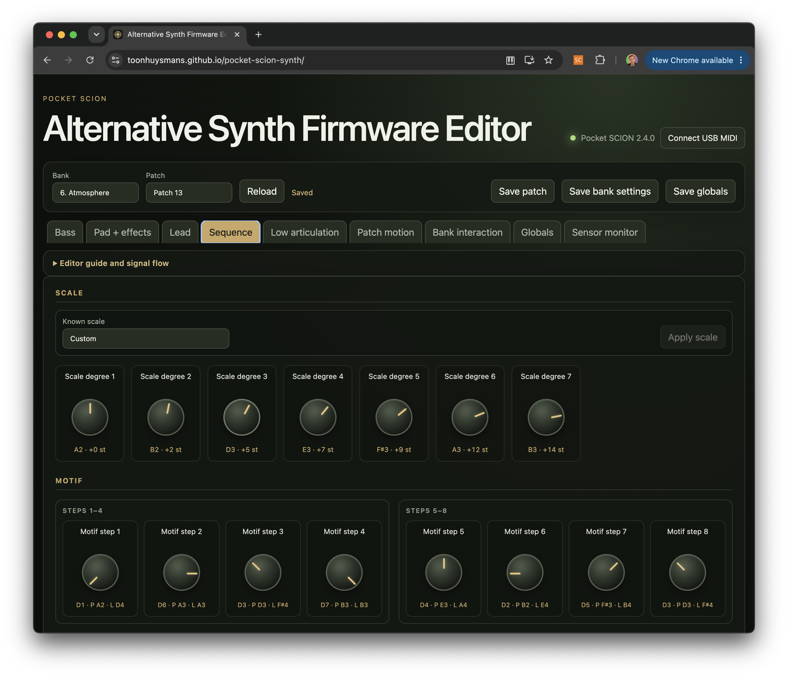

# Pocket SCION Synth

An alternative, clean-room firmware for the Instruō Pocket SCION that turns
the RP2040 hardware into a real-time, sensor-driven multitimbral synthesizer.
Instead of selecting prerecorded samples, it generates every sound live with
oscillators, filters, envelopes, LFOs, chorus, delay, and three distinct
musical roles: bass/percussion, pad, and lead.

Release v2.5.0 expands the multi-timbral instrument to 256 patches and adds
tunable adaptive plant-sensor calibration with live diagnostic graphs.
The previous [v2.3.0 single-timbre release](https://github.com/toonhuysmans/pocket-scion-synth/releases/tag/v2.3.0)
remains available as a rollback option.

[](https://youtu.be/fdCGtOZ-8es)

This is an independent community project. It is not affiliated with or
endorsed by Instruō. Pocket SCION and Instruō are trademarks of their
respective owner.

## Highlights

- 256 deliberately designed patches across sixteen banks
- Three sensor-modulated Euclidean rhythm lanes
- Separate bass/percussion, pad, and lead PRA32-U synthesis at 48 kHz
- Sensor control of notes, expression, timbre, rhythm, ratchets, and pitch bend
- DIN MIDI output plus bidirectional class-compliant USB MIDI
- Browser patch editor with live control, flash saves, and patch/bank JSON
- Per-patch Bass, Percussion, or Hybrid low role with six editable drum slots
- Patch-shared chorus and stereo delay across the complete three-part mix
- Single-channel and three-channel MIDI modes
- Raw sensor pulse output with pressure-to-pitch response
- Nine-pixel RGB display linked to live amp envelopes, LFO, polyphony, and
  ratchets
- No original Pocket SCION samples or firmware code in this repository

## Install the compiled firmware

The ready-to-flash build is
[`pocket_scion_synth_v2.5.0.uf2`](https://github.com/toonhuysmans/pocket-scion-synth/releases/download/v2.5.0/pocket_scion_synth_v2.5.0.uf2)
from the [v2.5.0 release](https://github.com/toonhuysmans/pocket-scion-synth/releases/tag/v2.5.0).

1. Disconnect the Pocket SCION from USB.
2. Hold its RP2040 boot-selection control while reconnecting USB, or otherwise
   enter the RP2040 USB bootloader.
3. A drive named `RPI-RP2` appears.
4. Copy the UF2 onto that drive.
5. Wait for the drive to disappear and the instrument to reboot.

The SHA-256 digest is:

```text
3397c4337ca47e358c64ad296834d90c62933368de25bd8d5ba52950d56023f6
```

Use moderate monitoring volume for the first boot. A short A/E/A startup chord
confirms that the audio path is working before sensor input begins.

## Restore the factory firmware

You can return to Instruō's original sample-based firmware at any time. Download
the official [Pocket SCÍON firmware 1.0.1 UF2](https://www.instruomodular.com/wp-content/uploads/firmware/pocket_scion_v1.0.1.uf2)
from Instruō, enter the RP2040 USB bootloader as described above, and copy that
UF2 to the `RPI-RP2` volume.

If the direct download changes, use Instruō's
[official firmware support page](https://www.instruomodular.com/firmware/) and
select the latest firmware listed under **Pocket SCÍON**. The factory firmware
is linked rather than redistributed by this project.

## How it works

GPIO0 supplies edge timestamps from the biofeedback oscillator. A configurable
number of accepted intervals forms one analysis window. Range, variance,
standard deviation, proximity, and trigger statistics continuously reshape a
generative sequencer.
Three Euclidean lanes choose notes from a scale. Independent
[PRA32-U](https://github.com/risgk/digital-synth-pra32-u) engines voice the low
lane as bass/percussion, the middle lane as a pad, and the high lane as a lead.
The dry low and lead sum enters the pad engine's
chorus/delay stage, then reaches the onboard DAC through an exact-rate PIO/DMA
I2S pipeline.

The firmware retains the useful physical interface—buttons, MIDI, raw mode,
and the five-ring RGB artwork—but gives it a new synthesis and sequencing
engine.

## Controls

| Control | Action |
|---|---|
| Sensitivity − / + | Sensor sensitivity |
| Volume − / + | Output volume |
| Instrument, single press | Next patch |
| Instrument, double press | Next bank |
| Instrument, triple press | Toggle single/multichannel MIDI |
| Hold Instrument | Toggle pitch bend bank |
| Hold Instrument + Sensitivity − / + | Note duration |
| Hold Instrument + Volume − / + | Root note by semitone |
| Hold both Sensitivity buttons for 3 s | Toggle Raw Output Mode |
| Hold both Volume buttons for 3 s | Toggle MIDI channel mode |

See [docs/controls.md](docs/controls.md) for display feedback and MIDI details.

## USB patch editor

The [`editor/`](editor/) web application exposes all three 47-parameter synth
snapshots together with sequence, sensor-routing, rhythm, MIDI, and global
settings. It runs in desktop Chrome or Edge through Web MIDI SysEx. Changes can
be auditioned live, explicitly saved into any of the 256 flash-backed slots,
reverted, restored to compiled defaults, and exchanged as readable patch or
bank JSON. [Open the hosted editor](https://toonhuysmans.github.io/pocket-scion-synth/)
or [choose a version-specific editor](https://toonhuysmans.github.io/pocket-scion-synth/versions/).
See the [editor guide](docs/editor.md) for the complete signal flow and
parameter reference.

[](https://toonhuysmans.github.io/pocket-scion-synth/)

## Documentation

- [Platform and peripherals](docs/platform.md)
- [Firmware architecture](docs/architecture.md)
- [Multitimbral branch design](docs/multitimbral.md)
- [Banks, scenes, and parameters](docs/banks-and-parameters.md)
- [Bass, percussion, and hybrid low lane](docs/low-articulation.md)
- [Controls, modes, and MIDI](docs/controls.md)
- [USB patch editor](docs/editor.md)
- [Open editor SysEx protocol](docs/editor-protocol.md)
- [Clean-room reverse engineering](docs/reverse-engineering.md)
- [Building from source](docs/building.md)
- [Hardware testing checklist](docs/hardware-testing.md)

## Contributing

Contributions are welcome. See [CONTRIBUTING.md](CONTRIBUTING.md) for the build,
test, hardware-validation, and clean-room requirements. Coding agents should
also follow the repository instructions in [AGENTS.md](AGENTS.md).

## Project layout

```text
boards/       RP2040 board definition
pio/          I2S and WS2812 PIO programs
src/          platform, sequencer, synthesis adapter, MIDI, and UI
editor/       installable TypeScript Web MIDI patch editor
tests/        host-side sensor mathematics tests
vendor/       pinned CC0 PRA32-U DSP headers and provenance
docs/         hardware and implementation documentation
releases/     verified compiled UF2
```

## License

The new platform firmware and documentation are MIT licensed. The vendored
PRA32-U DSP is CC0 1.0 Universal and retains its upstream license and provenance
inside [`vendor/pra32-u`](vendor/pra32-u). See
[THIRD_PARTY_NOTICES.md](THIRD_PARTY_NOTICES.md).

No original Pocket SCION firmware image, manual, extracted audio, or sample
content is distributed here.
